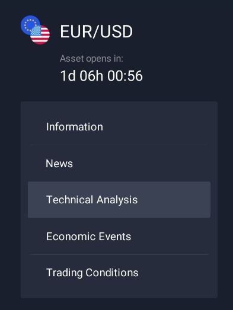
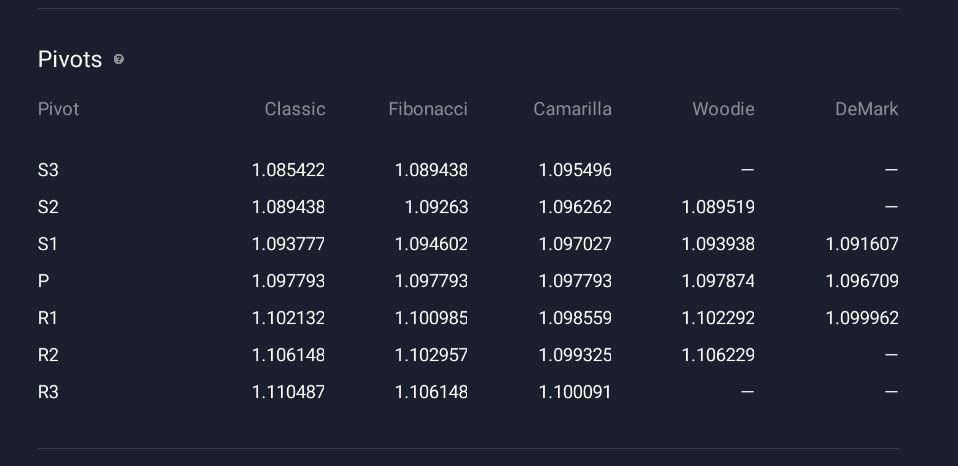

## Tecnical analysis

It is available in same assets and you can check it on asset info:


if there is a session like this you can get data:

NOTE: If there is no techinical Analysis on asset you want, you can't use it.



There are some indicators available:

## Pivots



## Oscillators


## Moving Averages


## How to use:

```python

asset="GBPUSD"
indicators = Iq.get_technical_indicators(asset)
print(indicators)

```

if assets doesn't contains technical Analysis it returns:

```
{
  "code": "no_technical_indicator_available",
  "message": "Active is not supported: active id 'ACTIVE_ID_PASSED'"
}
```

If there is something:

NOTE: YOU MUST TO ANALYSE THE PRINT OUTPUT

```json
[
  {
    "action": "hold",
    "candle_size": 60,
    "group": "OSCILLATORS",
    "name": "Relative Strength Index (14)",
    "value": 59.168583
  },
  {
    "action": "hold",
    "candle_size": 60,
    "group": "PIVOTS",
    "name": "Classic s3",
    "value": 1.057292
  }
  .....
]
```
